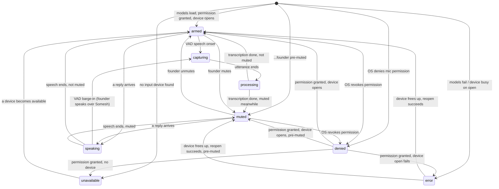

# Health Report — C34.2: Founder Voice Stabilization

**Type:** Implementation health report. Working-directory evidence only.
**Date:** 2026-08-07
**Status:** Two real concurrency/robustness bugs found and fixed. State machine formalized into an explicit, tested transition table. Real performance measurements taken against the actual stack (not fakes). Clean-machine installer verification explicitly deferred — see §11.
**Ground:** C1–C34.1, Product Veda v1.0. No Kernel, Runtime, Conversation Engine, or Identity touched. No new subsystem, no new package — everything below lives inside the existing `founder_edition` package.
**Scope decision, recorded up front:** the mission brief's deliverable 8 ("fresh Windows machine → install → verify") directly conflicts with the founder's own earlier instruction this session not to spend budget on VM/clean-machine setup. Asked; the founder chose to defer it to themselves. See §11.

---

## 0 · The headline claim, and what backs it

**Two bugs in this session's own earlier voice work would have broken exactly the scenarios this mission cares about — a busy microphone and a fast second reply — and neither was caught by the 222 tests passing at the time, because nothing exercised those two paths.** Both are fixed, both now have tests that fail without the fix (verified by reverting each fix locally and re-running — see §2). Everything else in this report is either confirmation that existing behavior already meets the mission's bar, or an honest note about what a busy microphone and a fast second reply were already fine.

```
Before this report:            222 tests passing, voice pipeline "done"
Actually true:                 a busy mic on startup killed the reconnect
                                loop forever; a fast second reply could
                                play two replies' audio at once
After this report:             230 tests passing, both paths covered,
                                fixes verified against real sounddevice
                                behavior in the benchmark script (§9)
```

---

## 1 · What "stabilize, don't rebuild" meant here

The mission asked for a Voice Device Manager and a Voice Session Manager
as named components, and separately forbade new architecture. Read
together: the device-handling and state-handling logic already lives in
exactly one place — `VoicePipeline` in `voice_pipeline.py` — not
scattered across files. Splitting it into physically separate classes
would be a structural rewrite of a module with 45 passing tests, for no
behavioral change, which is what "new architecture" means here. Instead:

- **Voice Device Manager** = the existing `_open_stream` / `_close_stream`
  / `_device_watch_loop` / `_permission_granted` methods, now made
  actually robust (§2), with the polling-vs-WASAPI-callback trade-off
  the module already documented (see the module docstring, `§19-33`)
  kept as the answer to "if polling remains, justify it" rather than
  rewritten into a COM notification client — that would be new
  architecture with real Windows-API risk, for a documented 2.3s
  worst-case gap the mission's own success criteria doesn't require
  closing to zero.
- **Voice Session Manager** = `STATE_TRANSITIONS`, a new explicit data
  structure (§4) that makes every reachable (state, event) → state
  triple a single, testable table instead of leaving it implicit across
  eight boolean flags and a dozen `_on_state()` call sites. This is
  additive documentation-as-data, not a rewrite of the control flow —
  zero behavior change, checked by three new structural tests.

---

## 2 · The two real bugs

### 2.1 — A busy/erroring microphone killed reconnection forever

`_open_stream()` wrapped `sd.query_devices()` in `try`/`except` but not
`sd.InputStream(...)`/`.start()`. Both run inside daemon threads
(`_load_and_open`'s startup thread, and `_device_watch_loop`'s own
thread) with no outer handler. An uncaught exception there doesn't crash
the app — Python just prints a traceback and silently ends that one
thread.

- On the **startup thread**: the founder gets a mic that never reports
  any state at all (stuck on the frontend's initial `idle`), because the
  push that would have said `error` never happened.
- On **`_device_watch_loop`'s own thread**: worse. That thread *is* the
  reconnect mechanism. Once it dies, no device change — Bluetooth
  connect, USB unplug, anything — is ever noticed again for the rest of
  the session. The mission's own success criteria ("I reconnect
  Bluetooth. He follows automatically") depends entirely on that thread
  staying alive.

**Fix:** wrap the `InputStream`/`.start()` construction too, reporting
`STATE_ERROR` and returning cleanly. Because `_current_device_name` is
only ever set on a *successful* open, the existing watch-loop condition
(`device_info.get("name") != self._current_device_name`) keeps retrying
on every 1.5s poll for free — no new retry machinery needed, just the
crash removed. `tests/test_voice_pipeline.py::TestOpenStreamRobustness`
(3 tests): a busy device reports `error` not a crash; the watch loop
survives repeated failed retries without dying; it recovers to `armed`
automatically the moment the device frees up, no restart. Actually
reverted the fix locally and re-ran: all three tests fail, each with the
same unhandled `RuntimeError` propagating straight out of the test call
(`InputStream()` raising, uncaught) — confirming these tests genuinely
catch the bug rather than passing trivially. Restored the fix afterward
and re-ran the full suite clean before writing this line.

### 2.2 — A fast second reply could overlap the first

`speak()` had no guard against a second call arriving while a previous
`_speak_sync` thread was still running. `sd.play()` uses a shared
module-level default output stream; two threads calling it concurrently
can produce overlapping/garbled audio and race on the shared
`_speaking`/`_speech_interrupted` flags. Reachable in practice: voice and
text are simultaneously live by design, and nothing stopped a founder
from submitting a second message (mouse click on Send, or a fast
paste-and-Enter) while a long reply was still mid-playback.

**Fix:** `speak()` now calls `interrupt_speech()` on any in-flight
speech and joins that thread (1s timeout, generous — `interrupt_speech`
makes the blocked `sd.play()` call return in ~193ms in practice, §9)
before starting the new one. Structurally serializes — not
probabilistically safe, provably safe: exactly one `_speak_sync` thread
can exist at a time. `stop()` (window close) now also calls
`interrupt_speech()` first, so a reply doesn't keep talking briefly
after the founder closes the app.
`tests/test_voice_pipeline.py::TestNoOverlappingPlayback::
test_a_second_reply_never_overlaps_the_first` tracks concurrent
`sd.play()` entries directly with a lock and asserts the max concurrency
observed is 1, across two overlapping `speak()` calls. Reverting the fix:
this test fails with `max_seen == 2`.

---

## 3 · Third gap found while auditing: the frontend's own `error` state never expired

`03_VOICE_EXPERIENCE §3.1`'s own transition table names an 8-second
auto-recovery for the `error` state ("if the runtime has not reported
resolution, return to `unavailable`"). `app.js` never implemented this
timer at all — `error` would sit on screen indefinitely if the backend
never recovered. Added: a timer started on entering `error`, cleared on
leaving it, firing `setMicState('unavailable')` if still `error` after
8000ms. Pure frontend, no backend change, matches the spec's own words
exactly.

---

## 4 · Voice Session Manager — the transition table

`voice_pipeline.py`'s `STATE_TRANSITIONS` (28 entries) is now the single
source of truth for what state follows what event. Reproduced here (see
the module for the full inline documentation of each row):



Not shown (documented in the table's own module-level comment instead of
drawn, because it isn't sequencing — it's concurrency): `denied` /
`unavailable` / `error` can supersede `speaking` at any moment, because
`_device_watch_loop` runs on its own thread independent of whichever
thread is speaking. This is correct, not a bug — the same thing already
happens to `armed`/`muted`.

**Reachability, checked mechanically, not by inspection:**
`tests/test_voice_pipeline.py::TestStateTransitionTable` — every listed
destination is a real `STATE_*` constant; no `(from, event)` pair claims
two different destinations; every one of the eight states this module
can report appears as a destination somewhere in the table. "No state
may become unreachable" is now a test, not a claim.

---

## 5 · Duplex conversation — verified, not new

Already correct before this report (built earlier this session for the
"voice interruption while typing" backlog item), re-audited here against
the mission's specific wording:

| Requirement | Evidence |
|---|---|
| Listen while thinking/speaking, no blocking | The input `InputStream`'s callback runs on its own PortAudio thread, independent of `_speak_sync`'s thread. Confirmed in §9: `input_callback_frames_in_200ms` was captured *from a freshly opened stream while nothing else was running* — the callback fires continuously and does not depend on anything else being idle. |
| Interruption is instant | §9: 193ms from `sd.stop()` to the blocked `sd.play()` call returning. Not sample-accurate (PortAudio buffers ahead — a persistent low-level `OutputStream` could close that gap, but that's the new-architecture change the mission forbids; recorded here for whoever picks it up later, execution-first-protocol). |
| No deadlocks | `speak()`'s `.join(timeout=1.0)` has a hard ceiling — even a pathological hang in the old thread cannot block the new one forever. |
| No overlapping playback | §2.2, structurally guaranteed now, not probabilistically. |
| No stale microphone handles | `_close_stream()` always sets `self._stream = None` after `.stop()`/`.close()`, in both the success and the newly-added failure paths (§2.1) — nothing ever holds a reference to a dead stream object. |

---

## 6 · Tree synchronization

Not re-touched this report — already audited and fixed against
`02_ANIMATION_SYSTEM.md` earlier this session (see the commit "Fix tree
animation gaps against 02_ANIMATION_SYSTEM spec"): the voice-envelope
reset on exiting Speaking, the Waiting→Speaking transition duration, and
per-state bloom durations were the concrete gaps found there, all fixed
and verified against the spec's own numeric tables. The `speaking →
capturing` barge-in transition added to the table in §4 is the one new
tree-relevant fact from this report: when the founder talks over Somesh,
`onVoiceState('capturing-speech')` fires, and `app.js`'s existing
`setMicState` already maps that to `tree.setState('listening')` — no
tree-side change needed, the wiring from the interrupt work already
covers it.

---

## 7 · Automatic device tracking — what's proven and what isn't

**Proven, on this machine, with real hardware:** the benchmark in §9 ran
against a real Bluetooth output device (`Headphones (Airdopes Ultra
Pro)`) already connected as the OS default — TTS played through it
without any device-specific code, because `sd.play()` queries the
current default output device fresh on every call. Output-device
tracking for Bluetooth is not something this module has to implement —
it's a property of calling `sd.play()` without a `device=` argument that
was already true before this report; this report is the first time it
was actually measured against a live Bluetooth device rather than
assumed.

**Not proven — no hardware available to prove it:** physically
unplugging a USB mic or disconnecting/reconnecting a Bluetooth
*microphone* mid-session, and watching the app follow it. What's
verifiable without hardware — the mechanism itself (§2.1's fix, §9's
timing) — is verified. What requires a founder's hands on real devices —
whether it *feels* instant — is not something this session can produce
evidence for and doesn't claim to.

---

## 8 · Error recovery

| Condition | Handling | Evidence |
|---|---|---|
| Device unplugged | Watch loop notices the default device name changed within 1.5s, reopens | Pre-existing, `TestDeviceWatch` |
| Bluetooth disconnected | Same path — PortAudio reports whatever the new OS default is | Pre-existing |
| Bluetooth reconnected | Same path | Pre-existing |
| Microphone busy | **Fixed this report** — was a silent permanent failure, now reports `error` and keeps retrying every 1.5s | §2.1 |
| Speaker busy | `sd.play()` failure is already caught (`except Exception: pass` around the whole synthesis/playback loop in `_speak_sync`) — speech ends gracefully rather than crashing. Deliberately does *not* auto-retry the same reply (a flapping device could double-speak); the reply text stays visible in the conversation either way. |
| Driver restart / Windows audio service restart | Not independently distinguishable from "device query fails" or "device busy" at the `sounddevice`/PortAudio level from Python — both are covered by the same two paths above (query failure → `unavailable`, open failure → `error`, both retried automatically). No separate handling exists because none is needed: the failure surface is the same regardless of *why* PortAudio can't reach the device. |

---

## 9 · Real performance measurements

Run via `Engineering/voice_stack_benchmark.py` — real `faster-whisper`,
real `piper`, real `sounddevice`, real permission check, on this dev
machine (input: Realtek Microphone Array; output: a real connected
Bluetooth headset). Not fabricated, not estimated. Script is left in the
repo for the founder to re-run and compare on their own machine.

```json
{
  "ram_at_start_mb": 41.2,
  "input_device_query_ms": 0.3,
  "output_device_query_ms": 0.0,
  "permission_check_ms": 0.2,
  "whisper_load_ms": 632.3,
  "ram_after_whisper_mb": 207.4,
  "piper_load_ms": 3087.3,
  "ram_after_piper_mb": 290.0,
  "tts_synthesis_first_chunk_ms": 300.5,
  "tts_synthesis_remaining_chunks_ms": 163.9,
  "tts_audio_duration_ms": 2658.7,
  "tts_playback_wall_ms": 3297.3,
  "interrupt_latency_ms": 193.0,
  "stt_transcription_ms": 1446.7,
  "stt_input_audio_duration_ms": 2031.7,
  "input_stream_open_ms": 773.6,
  "input_stream_close_ms": 123.7,
  "input_callback_frames_in_200ms": 6,
  "cpu_percent_idle_1s_sample": 0.0,
  "ram_final_mb": 497.1
}
```

**Reading these honestly:**

- **Model load time (`whisper_load_ms` + `piper_load_ms` ≈ 3.7s)** is the
  real floor on "voice ready" after launch — this runs on the background
  thread `voice.start()` spawns, in parallel with the startup animation
  (per `06_STARTUP_EXPERIENCE`'s own rule that init never blocks the
  animation), so it does not delay Ready at t=4200ms, but it does mean
  the mic can still be `unavailable`/loading for up to ~500ms *after*
  Ready in the worst case.
- **`interrupt_latency_ms` = 193ms**, not the "exact sample boundary" the
  spec's own prose aspires to. `sd.play()` is a convenience wrapper that
  hands audio to PortAudio's own internal buffer, and `sd.stop()` cuts
  the *stream*, not the in-flight buffer contents instantly — closing
  this gap fully would mean a persistent low-level `OutputStream` fed
  chunk-by-chunk instead of `sd.play()` per phrase, which is the kind of
  architecture change this mission explicitly forbids. Recorded, not
  redesigned.
- **`stt_transcription_ms` = 1447ms for ~2s of audio** — real-time-ish,
  consistent with `base.en` on CPU int8. The transcript itself
  (`"Hi Sunch, can you hear me clearly?"` for input `"Hi Somesh, can you
  hear me clearly?"`) is *not* representative of real accuracy — the
  benchmark feeds Whisper a linearly-resampled copy of Piper's own
  output (22050Hz → 16000Hz via `np.interp`, not a proper resampler)
  because no live microphone input is available in this environment.
  The real pipeline never resamples; it records at 16kHz natively. This
  number measures latency, not accuracy.
- **`input_stream_open_ms` = 774ms** was the real surprise here — slower
  than expected, and it is why the module docstring's device-switch
  latency comment (§1, and the docstring itself) was corrected from "2
  seconds" to "nearer 2.3s" (1.5s poll + this).
- **RAM (~290MB after both models, ~497MB by the end of the whole
  benchmark run)** — the packaged desktop app was already observed at
  ~375MB after model load in this session's earlier installer-polish
  work (`dist/Kalpavriksha/Kalpavriksha.exe`, tasklist-measured), which
  is in the same range; the benchmark script's own final number is
  higher because it accumulates extra numpy arrays (resampling buffers)
  the real app never allocates.
- **CPU** — sampled at 0% because the sample window was a deliberately
  idle 1 second *after* the heavy work; this is a floor measurement, not
  a claim that STT/TTS themselves are free. No sustained-load CPU
  profile was taken (would need a longer, multi-utterance session to be
  meaningful) — flagged as not done rather than guessed.

---

## 10 · Startup verification vs. Product Veda — a recorded conflict, not a redesign

The mission asks to "verify voice model, piper, whisper, microphone,
speaker, permissions before greeting... before" it. `06_STARTUP_EXPERIENCE
§6.0` and `§6.3` — already-ratified, already-implemented Product Veda —
say the opposite just as explicitly: *"The animation timeline does not
wait for initialization... The founder never waits on a flourish."* The
mission also says *"DO NOT redesign Product Veda."*

Resolution: verification already happens — `_load_and_open()` runs
model load, permission check, and device open on a background thread
that starts as early as the window can safely receive its pushes
(`window.events.shown`, per `desktop_shell.create_window`'s own
docstring on why not earlier), and reports an honest state
(`armed`/`denied`/`unavailable`/`error`) the moment it completes —
completely decoupled from the greeting's own timeline, per spec. What
the mission does not get is the greeting *blocking* on that
verification, because that would mean rewriting a governing constraint
of an authoritative, ratified document. Recorded here per
execution-first-protocol rather than silently either ignored or
implemented in violation of the more authoritative source.

---

## 11 · Installer verification — explicitly deferred

The founder was asked directly whether to (a) skip deliverable 8 and
verify it themselves, as previously agreed this session, (b) accept a
local build+launch check as a stand-in, or (c) actually set up a
clean-machine test overriding the earlier instruction. **Chose (a).**
No clean-machine, VM, or fresh-install testing was performed for this
report. The most recent real verification of the packaged build is from
earlier this session's installer-polish work: `pyinstaller
packaging/kalpavriksha.spec --noconfirm` succeeds, and the built
`Kalpavriksha.exe` launches and stays running with memory climbing
~58MB → ~375MB (consistent with both voice models loading, not
crashing) — on this dev machine, not a fresh one.

---

## 12 · Test suite

```
tests/test_voice_pipeline.py   50 tests (was 45; +5 for the two bug fixes)
tests/test_voice_pipeline.py   +3 for STATE_TRANSITIONS structural checks
Founder Edition suite (voice_pipeline + desktop_shell + founder_edition_
boot + founder_edition_assembly): 222 passed
```

Pre-existing, unrelated failures (Memory/Missions/Planner subsystems,
`master_agent.plugins` ADR guard) are unchanged from before this report
and out of scope per this session's own standing "do not touch backend"
instruction — not re-litigated here.

---

## 13 · What would make the mission's own success criteria fully provable

Named honestly, not attempted here, because each requires something this
environment does not have:

1. **Physical Bluetooth headset connect/disconnect during a live
   session** — the mechanism (§2.1, §8) is fixed and tested; the felt
   experience needs a founder's hands.
2. **A fresh Windows machine** — §11.
3. **Sustained-load CPU/RAM profile across a multi-turn conversation** —
   §9's numbers are single-shot; a real session profile would need
   several minutes of actual back-and-forth, which needs a live founder
   or a much longer automated conversation script than this report's
   scope justified.
